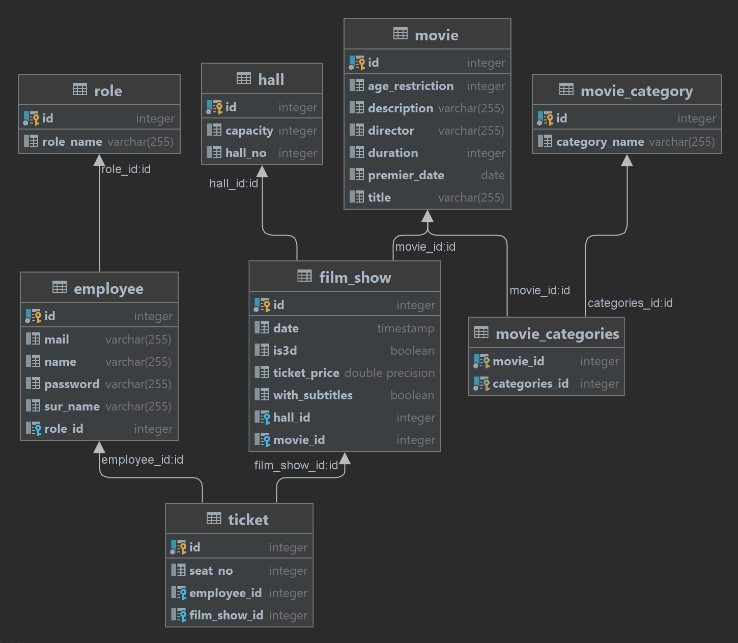
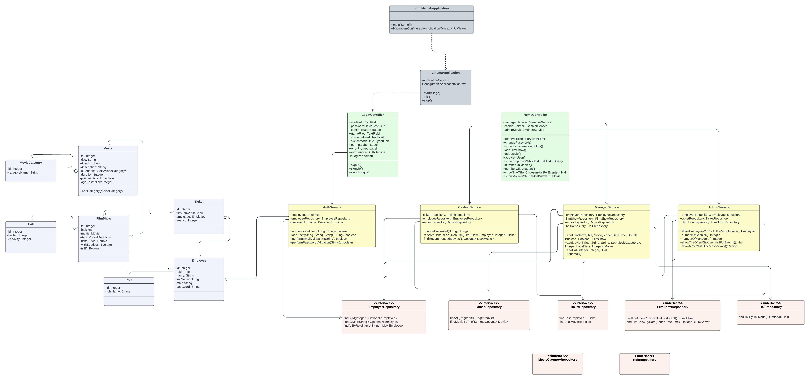
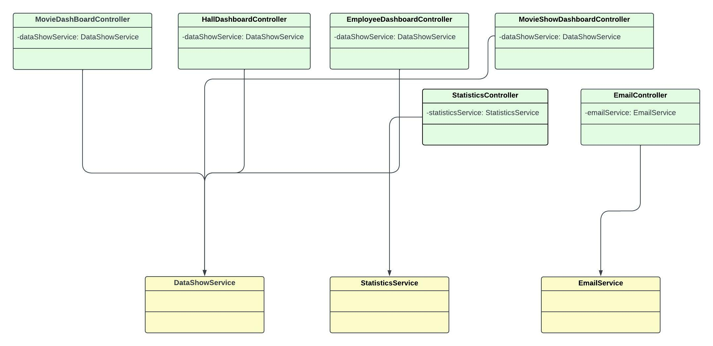


<h1 align="center">KinoManiak - dokumentacja</h1>

<h2>1. Wstęp</h2>

Aplikacja KinoManiak ma w założeniach dostarczać podstawowych funkcjonalności
systemu do obsługi multipleksu kinowego. System ma w minimalnych założeniach umożliwiać:

- Wprowadzenie nowego użytkownika: imię, nazwisko i email (poprawność danych)
- Obsługę wielu sal
- Wyświetlenie polecanych filmów
- Użytkowników z różnymi uprawnieniami
- Wysyłanie maili z powiadomieniami
- Generowanie statystyk

Do napisania aplikacji użyte zostały następujące technologie:

- język Java 17
- narzędzie do automatycznej kompilacji Gradle
- frameworki Spring, JavaFX, nakładka FxWeaver do współpracy Springa z JavaFX
- baza danych PostgreSQL umieszczona w kontenerze Docker


<h2>2. Role użytkowników i funkcje aplikacji</h2>


W aplikacji realizowany będzie podział użytkowników na 3 role:

- Administrator
- Manager
- Kasjer

a) **Admin**
- Posiada wszystkie uprawnienia Managera
- Ma możliwość przyznawania ról użytkownikom systemu
- Ma możliwość podejrzenia statystyk

b) **Manager**

- Posiada wszystkie uprawnienia Kasjera
- Ma możliwość dodawania seansów
- Ma możliwość dodawania filmów, sal
- Ma możliwość wysyłania maili


c) **Kasjer**

- Ma możliwość sprzedawania biletów
- Ma możliwość wyświetlenia seansów, filmów
- Ma możliwość generowania polecanego repertuaru (na podstawie daty premiery filmu)


<h2>3. Model bazodanowy</h2>

  


  
**Opis tabel:**

**Role** - zawiera role użytkowników systemu    
**Employee** -  zawiera wszystkich użytkowników systemu, każdy z nich posiada role, mail,hasło  
**Movie** - zawiera dane dotyczące filmów wyświetlanych w kinie       
**Movie_Category** - zawiera nazwy gatunków filmów jak np. horror czy fantasy       
**Movie_Categories** - tabela łącznikowa - jeden film może mieć wiele kategorii,
jedną kategorie może mieć wiele filmów   
**Hall** - zawiera informacje dotyczące sal kinowych - nr sali, ilość miejsc    
**FilmShow** - zawiera informacje dotyczące konkretnych seansów jak godzina, cena biletów, jest połączona z konkretnym filmem i salą    
**Ticket** - zawiera informacje dotyczące biletów. Bilet ma numer fotela, powiązany jest z konkretnym seansem i kasjerem, który obsługiwał jego biletu


<h2>4. Model dziedzinowy</h2>
  

  

Rozszerzenie modelu (przyszłość projektu):



**Funkcje klas:**
- Klasy uruchamiające system
  - Oznaczone kolorem szarym
  - Odpowiadają za uruchomienie aplikacji wraz z początkową konfiguracją i synchronizacją używanych frameworków

- Klasy z warstwy dziedzinowej
  - Oznaczone kolorem jasnoniebieskim
  - Są odwzorowaniem encji z używanej bazy danych
  - Mapowane na klasy za pomocą Spring JPA


- Klasy z warstwy kontrolerów
  - Oznaczone kolorem jasnozielonym
  - Pełnią funkcję pośredników w komunikacji między widokami JavaFX, a klasami dziedzinowymi
  - Implementują metody modyfikujące szatę graficzną
  - Do komunikacji z modelem używają serwisów

- Klasy z warstwy serwisów
  - Oznaczone kolorem żółtym
  - Pobierają/modyfikują/dodają/usuwają obiekty dziedzinowe, wykorzystując do tego odpowiednie repozytoria

- Klasy z warstwy repozytoriów
  - Oznaczone kolorem bladoczerwonym
  - Definiują metody umożliwiające operacje na bazodanowych tabelach


<h2>5. Instrukcja uruchomienia</h2>

Do skorzystania z aplikacji KinoManiak, należy mieć zainstalowane lokalnie:
- Java 17
- Docker

Pobieramy obraz z dockera:
```
docker pull pwgacek/kinomaniak_db
```
Odpalamy kontener z bazą danych:
```
docker run --name kinomaniak --env PGDATA=postgres -d -p 5433:5432 -i pwgacek/kinomaniak_db
```
W application.properties sprawdzamy czy user, hasło i numer portu są poprawnie ustawione:

**Port:5433**   
**User: postgres**  
**Password: postgres**

Baza jest gotowa do użytku

Aby uruchomić aplikację, należy zbudować projekt gradle i wystartować klasę KinoManiakApplication zawierającą metodę main().

